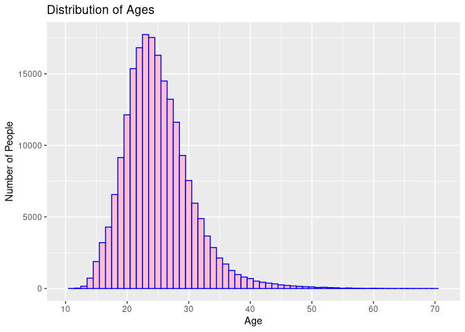
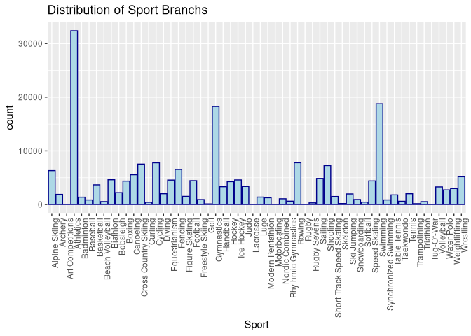
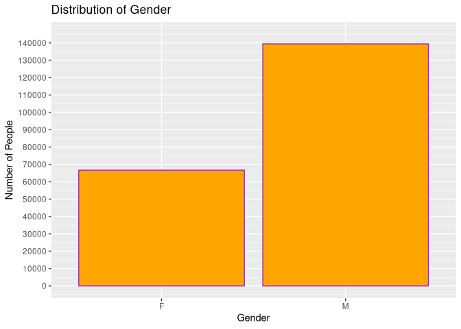
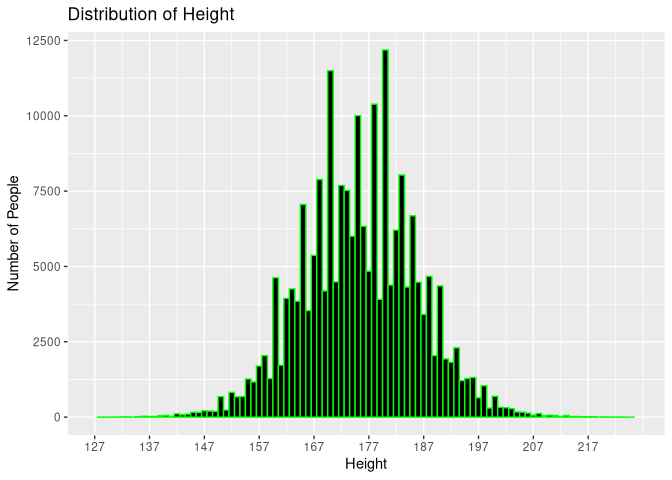
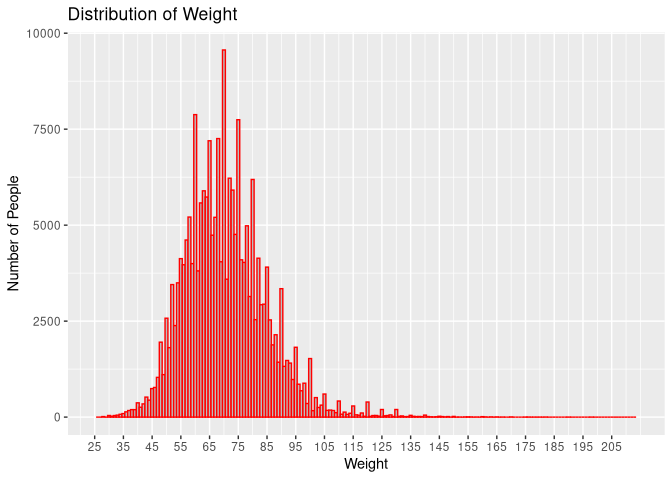
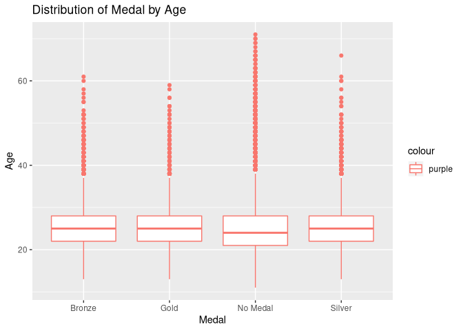
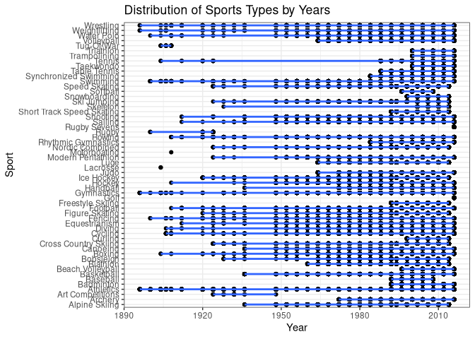
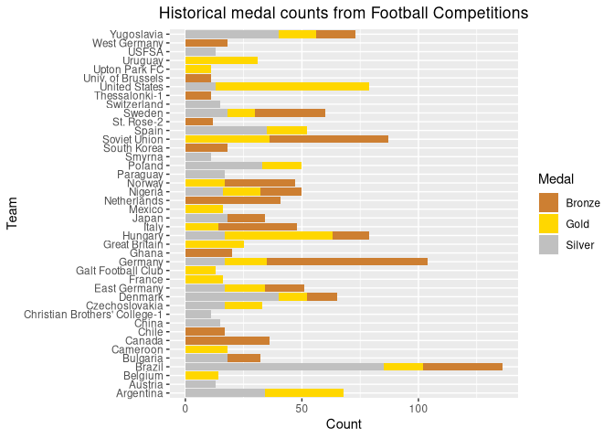
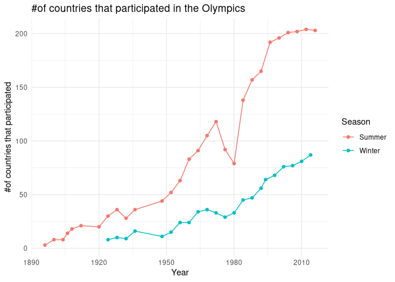

Introduction
============

<center>

</center>

For years, Olympics have been held around the world, and participants from around the world compete to succeed in different sports. We wanted to work with this data because we want to look for answers to the questions about which countries are superior in which branches, which countries are leading women or men in which sports and bringing medals to their country. We choose a dataset which is a historical dataset on the modern Olympic Games, including all the Games from Athens 1896 to Rio 2016. Dataset contains 271116 observations and 15 variables. ID, number, gender, age, height, weight, Team, NOC, games, Year, season, city, sport, event and medal parameters are used in this dataset as variables.

Information of the Dataset
==========================

This is a historical dataset on the modern Olympic Games, including all the Games from Athens 1896 to Rio 2016. The athlete events dataset contains information about Olympic Athletes and events that they have competed in, including biological data (Age, Sex, Height, Weight etc.) and event data (Year, Season, City, Sport etc.). The NOC (National Organizing Committee) regions dataset possesses information about the countries that compete in the Olympics, including the country name and any notes about said country.

The file athlete\_events.csv contains 271116 rows and 15 columns. Each row corresponds to an individual athlete competing in an individual Olympic event.

The Athletes dataset contains 15 variables:

1.  ID: A number used as a unique identifier for each athlete
2.  Name: The athlete’s name(s) in the form of First Middle Last where
    available
3.  Sex: The athlete’s gender; one of M or F 4 Age: The athlete’s age in
    years
4.  Height: The athlete’s height in centimeters (cm)
5.  Weight: The athlete’s weight in kilograms (kg)
6.  Team: The name of the team that the athlete competed for
7.  NOC: The National Organizing Committee’s 3-letter code
8.  Games: The year and season of the Olympics the athlete competed in
    in the format YYYY Season
9.  Year: The year of the Olympics that the athlete competed in
10. Season: The season of the Olympics that the athlete competed in
11. City: The city that hosted the Olympics that the athlete competed in
12. Sport: The sport that the athlete competed in
13. Event: The event that the athlete competed in
14. Medal: The medal won by the athlete; one of Gold, Silver, or Bronze.
    NA if no medal was won.

Dataset Link:
<a href="https://www.kaggle.com/heesoo37/120-years-of-olympic-history-athletes-and-results#athlete_events.csv" class="uri">https://www.kaggle.com/heesoo37/120-years-of-olympic-history-athletes-and-results#athlete_events.csv</a>

Loading the dataset and the summary
-----------------------------------

``` r
getwd()
```

    ## [1] "/home/mertdgn/Desktop/R_project"

``` r
setwd("/home/mertdgn/Desktop/R_project")
a <- read.csv("athlete_events.csv")
summary(a)
```

    ##        ID                               Name        Sex             Age       
    ##  Min.   :     1   Robert Tait McKenzie    :    58   F: 74522   Min.   :10.00  
    ##  1st Qu.: 34643   Heikki Ilmari Savolainen:    39   M:196594   1st Qu.:21.00  
    ##  Median : 68205   Joseph "Josy" Stoffel   :    38              Median :24.00  
    ##  Mean   : 68249   Ioannis Theofilakis     :    36              Mean   :25.56  
    ##  3rd Qu.:102097   Takashi Ono             :    33              3rd Qu.:28.00  
    ##  Max.   :135571   Alexandros Theofilakis  :    32              Max.   :97.00  
    ##                   (Other)                 :270880              NA's   :9474   
    ##      Height          Weight                 Team             NOC        
    ##  Min.   :127.0   Min.   : 25.0   United States: 17847   USA    : 18853  
    ##  1st Qu.:168.0   1st Qu.: 60.0   France       : 11988   FRA    : 12758  
    ##  Median :175.0   Median : 70.0   Great Britain: 11404   GBR    : 12256  
    ##  Mean   :175.3   Mean   : 70.7   Italy        : 10260   ITA    : 10715  
    ##  3rd Qu.:183.0   3rd Qu.: 79.0   Germany      :  9326   GER    :  9830  
    ##  Max.   :226.0   Max.   :214.0   Canada       :  9279   CAN    :  9733  
    ##  NA's   :60171   NA's   :62875   (Other)      :201012   (Other):196971  
    ##          Games             Year         Season                   City       
    ##  2000 Summer: 13821   Min.   :1896   Summer:222552   London        : 22426  
    ##  1996 Summer: 13780   1st Qu.:1960   Winter: 48564   Athina        : 15556  
    ##  2016 Summer: 13688   Median :1988                   Sydney        : 13821  
    ##  2008 Summer: 13602   Mean   :1978                   Atlanta       : 13780  
    ##  2004 Summer: 13443   3rd Qu.:2002                   Rio de Janeiro: 13688  
    ##  1992 Summer: 12977   Max.   :2016                   Beijing       : 13602  
    ##  (Other)    :189805                                  (Other)       :178243  
    ##         Sport                                        Event       
    ##  Athletics : 38624   Football Men's Football            :  5733  
    ##  Gymnastics: 26707   Ice Hockey Men's Ice Hockey        :  4762  
    ##  Swimming  : 23195   Hockey Men's Hockey                :  3958  
    ##  Shooting  : 11448   Water Polo Men's Water Polo        :  3358  
    ##  Cycling   : 10859   Basketball Men's Basketball        :  3280  
    ##  Fencing   : 10735   Cycling Men's Road Race, Individual:  2947  
    ##  (Other)   :149548   (Other)                            :247078  
    ##     Medal       
    ##  Bronze: 13295  
    ##  Gold  : 13372  
    ##  Silver: 13116  
    ##  NA's  :231333  
    ##                 
    ##                 
    ## 

Loading the required libraries
------------------------------

``` r
library(ggplot2)
library(magrittr) # needs to be run every time you start R and want to use %>%
library(dplyr)  
```

    ## 
    ## Attaching package: 'dplyr'

    ## The following objects are masked from 'package:stats':
    ## 
    ##     filter, lag

    ## The following objects are masked from 'package:base':
    ## 
    ##     intersect, setdiff, setequal, union

Categorical Variables
---------------------

1.  Medal
2.  Event
3.  Sport
4.  Season
5.  Games
6.  NOC
7.  Team
8.  Sex
9.  Name

**So, there are 9 categorical variables**

Handle NA Values
----------------

Handle all NA values except not medal column variables

``` r
na <- subset(a, !is.na(Height+Weight+Age)) #Medal haricinde NA'siz.
```

Change Na variables in the Medal to ‘No Medal’

``` r
na$Medal <- as.character(na$Medal)
na$Medal[is.na(na$Medal)] <- "No Medal"
```

One Variable Plots
==================

In this section, we plot one variable plots by using information from
the dataset

Distribution of ages
--------------------

``` r
qplot(x=Age, data=na,
      xlab="Age",
      ylab="Number of People",
      main = ("Distribution of Ages"),
      geom="histogram",
      binwidth=1,
      fill=I("pink"),
      col=I("blue"))+
  scale_x_continuous(limits = c(10,71), breaks = seq(10,71,10))
```

    ## Warning: Removed 2 rows containing missing values (geom_bar).



> In this plot, we want to see the distribution of ages by number of
> people. We choose histogram because we want to see clearly the age
> distribution from the plot by looking the columns. We can see that
> there is the highest number of athletes between the ages of 20-30. The
> 23-year-old athletes participate in the Olympics. There is no
> participation of athletes over the age of 56. In addition, the
> youngest athletes participating in the Olympics are 10 years old.

Distribution of sport branchs
-----------------------------

``` r
p <- ggplot(na, aes(x = `Sport`))+
       geom_bar(color="darkblue", fill="lightblue")+
  ggtitle("Distribution of Sport Branchs") +
  theme(axis.text.x = element_text(angle = 90, hjust = 1))
p
```



> In this plot, we want to see the distribution of sport branchs by
> number of the branch count. We choose histogram because we want to see
> clearly the sport branch distribution from the plot by looking the
> columns. In addition we use theme to change angle of the branches so
> we can see the branches clearly on the x-axis. We can see easily ‘Art
> Competitions’, ‘Gymnastics’ and ‘Swimming’ has the higher rate than
> others. In addition, basketball was expected to be higher, but less
> athletes participated in many sports. The reason why this is a
> different detail is that in many countries the ‘Biathlon’ sport is
> less well known than Basketball.

Distribution of sex
-------------------

``` r
qplot(x=Sex, data=na,
      xlab="Gender",
      ylab="Number of People",
      main = ("Distribution of Gender"),
      fill=I("orange"),
      col=I("purple"))+
  scale_y_continuous(limits = c(0,145000), breaks = seq(0,145000,10000))
```



> In this plot, we can observe the sex distribution of the
> participations. We choose histogram because we want to see clearly the
> sex distribution from the plot by looking the columns. As shown in the
> plot, the male competitor ratio is twice the female competitor ratio.
> It is very unfortunate that even in the field of sports branches such
> as the Olympics, we find women and men inequality.

Distribution of heights
-----------------------

``` r
qplot(x=Height, data=na,
      xlab="Height",
      ylab="Number of People",
      main = ("Distribution of Height"),
      geom="histogram",
      binwidth=1,
      fill=I("black"),
      col=I("green"))+
  scale_x_continuous(limits = c(127,226), breaks = seq(127,226,10))
```

    ## Warning: Removed 2 rows containing missing values (geom_bar).



> We just want to for observe the distribution of the heights. The best
> way to do this is to plot a histogram

Distribution of weights
-----------------------

``` r
qplot(x=Weight, data=na,
      xlab="Weight",
      ylab="Number of People",
      main = ("Distribution of Weight"),
      geom="histogram",
      binwidth=1,
      fill=I("grey"),
      col=I("red"))+
  scale_x_continuous(limits = c(25,214), breaks = seq(25,214,10))
```

    ## Warning: Removed 2 rows containing missing values (geom_bar).



> We just want to for observe the distribution of the weights. The best
> way to do this is to plot a histogram

Two Variable Plots
==================

In this section, we plot two variable plots by using information from
the dataset

Distribution of medal and ages
------------------------------

``` r
qplot(x=Medal, y=Age, data=na, main=('Distribution of Medal by Age'), geom='boxplot', color='purple')
```



> In this plot, we see the medal types of the people who were entering
> the Olympics. We handle the NA values by changing its value to the ‘No
> Medal’. We can see that there is the highest mean of medal awards
> between the ages of 22-28. Absolutely it is normal, because younger
> people are be able to win medals than the older people. In addition,
> we can see there are outliers after 38 age. We use boxplot because we
> want to see median and outliers to analyse and easily see the medal
> distribution statistics by age.

Distribution of olympic games over years
----------------------------------------

``` r
ggplot(data = na) +
  aes(x = Year) +
  aes(y = `Sport`) +
  geom_point() +
  geom_smooth(method = "lm", se = T) +
  scale_x_continuous(limits= c(1896,2016))+
  scale_color_manual(values = c("black", "yellow")) +
  labs(col = "") +
  labs(title = "Distribution of Sports Types by Years") +
  theme_bw()
```



> In this plot, we want to observe sports branchs and their played rate
> distributed by years. As we can see, there are huge gap between
> 1936-1948. In these years there were no olympics games played. Because
> that, there are World War II in these years. In addition, there are
> also a gap between 1912-1920. In these years there were mostly no
> olympics games played. Because that, there are World War I in these
> years. Lacrosse game branch have played at once in the 1905. It is so
> interesting, when we observe the olympics games. And the tennis branch
> was not played for 46 years in the period of 1924-1980. In the end, we
> can see the olympics games play in every 4 years.

Distribution of medal counts and types over countries
-----------------------------------------------------

``` r
ftbl <- a %>% 
  filter(Sport == "Football") %>%
  select(Name, Sex, Age, Team, NOC, Year, City, Event, Medal)

# Count Events, Nations, and Football competitions each year
counts_ftbl <- ftbl %>% filter(Team != "Unknown") %>%
  group_by(Year) %>%
  summarize(
    Events = length(unique(Event)),
    Nations = length(unique(Team)),
    Footballs = length(unique(Name))
  )

##############continues to plot################
# count number of medals awarded to each Team
medal_counts_ftbl <- ftbl %>% filter(!is.na(Medal))%>%
  group_by(Team, Medal) %>%
  summarize(Count=length(Medal)) 

#plot
ggplot(medal_counts_ftbl, aes(x=Team, y=Count, fill=Medal)) +
  geom_col() +
  coord_flip() +
  scale_fill_manual(values=c("#CD7F32","#FFD700","#C0C0C0")) +
  ggtitle("Historical medal counts from Football Competitions") +
  theme(plot.title = element_text(hjust = 0.5))
```



> In this plot, we can observe that the medal counts and types for each
> teams. As we can see, the most medal winners are USA, Germany, Brazil,
> SSCB, Yugoslavia. As a fact that the governments in these countries
> support. Olympic games especially football and as a natural result;
> these countries has more medals than other countries by the help of
> some politic reasons in their country. We choose histogram because we
> want to clearly see the medal distribution and also determine which
> medal type won by which country. We also flipped the histogram
> coordinates. Thus, we can easily analyze the medal distribution over
> the countries.

Distribution of olympics participants over season
-------------------------------------------------

``` r
na %>%
  group_by(Year, Season) %>%
  summarise(NoOfCountries = length(unique(NOC))) %>%
  ggplot(aes(x = Year, y = NoOfCountries, group = Season)) +
  geom_line(aes(color = Season)) +
  geom_point(aes(color = Season)) +
  labs(x = "Year", y = "#of countries that participated", title = "#of countries that participated in the Olympics") +
  theme_minimal()
```



> In this plot, we can observe that the number of participants in the
> olympics have grown overtime. It is also obvious that the number of
> participants in the summer olympics are more than that of the winter
> olympics. As a natural result, in summer olympics there are a lot of
> participants than winter olympics. We choose scatter plot and lines
> because we want to clearly see the weather distribution with rates and
> also determine which years and the count of the countries decreasing
> or increasing by looking the graph. Thus, we can easily analyze the
> weather rate over the countries that participated.
